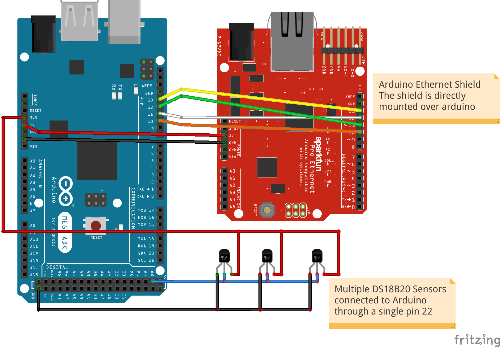

# One Wire Temperature Sensor with NTP

DS18B20 is One Wire Temperature sensor which is integrated with Arduino Mega. The Arduino Mega is also connected to LAN shield in order to send data over LAN using MQTT protocol.

